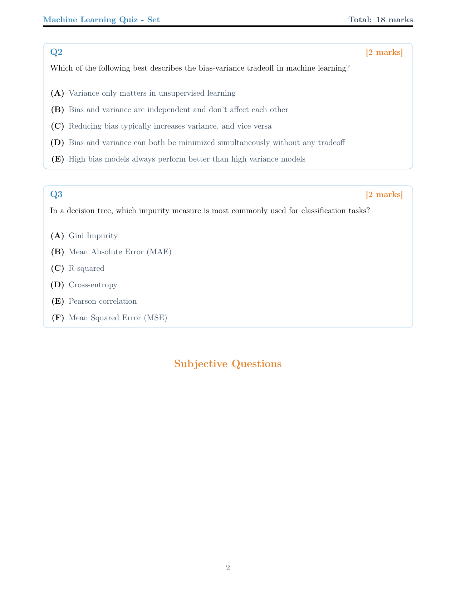

# Setwise: Professional LaTeX Quiz Generator

[](https://github.com/nipunbatra/setwise/actions/workflows/ci.yml)
[](https://codecov.io/gh/nipunbatra/setwise)
[](https://www.python.org/downloads/)
[](https://opensource.org/licenses/MIT)
[](https://github.com/nipunbatra/setwise/issues?q=is%3Aissue+is%3Aopen+label%3Asecurity)

> A professional Python-based quiz generation system that creates beautiful, randomized PDF quizzes with comprehensive machine learning content.

## Template Showcase - 3 Professional Templates

### Default Template (Professional)
Professional single-column layout with color-coded sections and spacious design

**Quiz Set 1 (All Pages)**
<div align="center">

| Page 1 | Page 2 | Page 3 |
|--------|--------|--------|
|  |  |  |

</div>

**Quiz Set 2 (Same Questions, Different Order)**
<div align="center">

| Page 1 | Page 2 | Page 3 |
|--------|--------|--------|
|  |  |  |

**[Download PDF - Default Template](assets/default_sample.pdf)**

**Use case:** Formal presentations, exams, professional documentation (3-4 pages typical)
</div>

### Compact Template (Space-Efficient)
Two-column layout with multi-column MCQ options for maximum space efficiency

**Quiz Set 1 vs Set 2 Comparison**
<div align="center">

| Quiz Set 1 | Quiz Set 2 |
|-------------|-------------|
|  |  |

**[Download PDF - Compact Template](assets/compact_sample.pdf)**

**Use case:** Printing, quick distribution, saving paper (1-2 pages typical)
</div>

### Minimal Template (Clean)
Minimalist black and white design with clean typography and high contrast

**Quiz Set 1 vs Set 2 Comparison**
<div align="center">

| Quiz Set 1 | Quiz Set 2 |
|-------------|-------------|
|  |  |

**[Download PDF - Minimal Template](assets/minimal_sample.pdf)**

**Use case:** Black & white printing, simple assessments, distraction-free (1-2 pages typical)
</div>

**Notice the Smart Randomization:** Same questions appear in both sets, but with shuffled MCQ options and different question order. Perfect for preventing cheating while maintaining fair assessment.

## Key Features

### Professional Output
- **Beautiful LaTeX Output** - Professional styling with color-coded sections
- **Multiple Templates** - 3 built-in templates: default, compact, minimal  
- **Rich Content** - Tables, TikZ diagrams, matplotlib plots, mathematical equations
- **Template Management** - Plug-and-play template system with easy selection

### Smart Generation
- **Smart Randomization** - MCQ options and question order shuffling with same questions across sets
- **Template Support** - Dynamic questions with variable substitution
- **Custom Question Libraries** - Support for user-defined question sets from any location
- **CLI Interface** - Full command-line control with reproducible seeds
- **Robust Validation** - Input validation and graceful error handling

### Security & Quality
- **Secure by Design** - No shell injection vulnerabilities, XSS protection
- **86% Test Coverage** - Comprehensive testing with 21+ quality assurance tests
- **Enhanced LaTeX Validation** - Smart detection of math expressions and auto-fixes
- **User Guidance System** - Intelligent error messages with actionable solutions
- **Automated Security Scanning** - Bandit, Safety, CodeQL, pip-audit
- **Quality Grade: GOOD** - 85.7% pass rate in comprehensive quality testing

### Modern Distribution
- **Pip Installable** - Modern Python packaging with pyproject.toml
- **Multiple Install Options** - Basic, development, and security extras
- **Cross-Platform** - Works on Windows, macOS, and Linux
- **Python 3.8+** - Support for modern Python versions
- **Professional CLI** - Intuitive command-line interface with help system

### Educational Excellence  
- **Comprehensive ML Content** - 20 MCQ + 15 subjective questions on supervised learning
- **Answer Keys** - Detailed explanations and solutions
- **Reproducible Assessment** - Consistent evaluation across different quiz sets

## Installation

```bash
# Install from GitHub source
pip install git+https://github.com/nipunbatra/setwise.git

# With web interface support
pip install git+https://github.com/nipunbatra/setwise.git[web]

# For development with all tools
pip install git+https://github.com/nipunbatra/setwise.git[dev,security]
```

## Quick Start

### New User Experience
```bash
# 🎉 Welcome guide for first-time users
setwise welcome

# 📚 Get format recommendation based on your needs
setwise questions recommend-format

# 🚀 Create example files in all formats
setwise questions create-examples --output-dir my_questions

# ✅ Enhanced validation with smart suggestions
setwise questions validate my_questions/sample_questions.yaml --verbose --auto-suggest

# 🔧 Auto-fix common LaTeX issues
setwise questions fix-latex my_questions/sample_questions.yaml

# 🎯 Generate your first quiz
setwise generate --questions-file my_questions/sample_questions.yaml
```

### Core Generation Commands
```bash
# Generate figures (TikZ diagrams and matplotlib plots)
setwise generate-figures

# Generate sample quizzes with default settings
setwise generate --seed 42

# Generate 5 quiz sets with specific question counts
setwise generate --seed 123 --sets 5 --mcq 3 --subjective 2

# Use a different template
setwise generate --template compact --sets 2

# Use custom questions from any location
setwise generate --questions-file /path/to/my_questions.py --sets 2

# List available templates
setwise list-templates

# Generate without PDF compilation (LaTeX only)
setwise generate --no-pdf --sets 1

# Custom output directory
setwise generate --output-dir my_quizzes --sets 3
```

### Python API Usage

```python
from setwise import QuizGenerator, TemplateManager

# Create quiz generator with custom questions
generator = QuizGenerator(
    output_dir="my_output",
    questions_file="/path/to/custom_questions.py"
)

# Generate quiz sets programmatically
success = generator.generate_quizzes(
    num_sets=3,
    num_mcq=5,
    num_subjective=2,
    template_name="compact",
    seed=42
)

# List available templates
tm = TemplateManager()
print(tm.list_templates())
```

## Command Line Options

### Generate Command
```bash
setwise generate [OPTIONS]

Options:
  --seed SEED           Random seed for reproducibility (default: random)
  --sets SETS           Number of quiz sets to generate (default: 3)
  --mcq MCQ             Number of MCQ questions per set (default: all available)
  --subjective NUM      Number of subjective questions per set (default: all available)
  --no-pdf              Skip PDF compilation, generate only LaTeX files
  --output-dir DIR      Output directory for generated files (default: ./output)
  --template NAME       Template to use: default, compact, minimal (default: default)
  --questions-file FILE Path to custom questions.py file (can be anywhere)
```

### Question Management Commands
```bash
# Enhanced User Experience
setwise welcome                                      # 🎉 Welcome guide for new users
setwise questions recommend-format                   # 📚 Interactive format recommendation
setwise questions format-comparison                  # 📊 Compare all available formats
setwise questions workflow first-time                # 🚀 First-time user workflow help

# File Operations
setwise questions create-examples --output-dir DIR   # 🎯 Create example files in all formats
setwise questions convert input.yaml output.json    # 🔄 Convert between formats
setwise questions validate FILE --verbose           # ✅ Enhanced validation with suggestions
setwise questions validate FILE --auto-suggest      # 🔧 Show available auto-fixes

# Quality Assurance
setwise questions fix-latex FILE                     # 🛠️ Auto-fix common LaTeX errors
setwise questions fix-latex FILE --dry-run          # 👀 Preview fixes without applying
setwise questions latex-help                        # 📖 LaTeX syntax help and examples

# Statistics and Analysis
setwise questions list                               # 🔍 Find and list question libraries
setwise questions create-sample FILE                # 📝 Create a sample questions file
setwise questions stats FILE                        # 📊 Show detailed statistics
```

### Other Commands
```bash
setwise list-templates                    # List all available templates with descriptions
setwise generate-figures                 # Generate TikZ diagrams and matplotlib plots
```

## Multi-Format Question Support

Setwise supports 5 different formats for creating questions, making it accessible to users with different preferences and workflows:

### Format Comparison
| Format | Best For | Pros | Cons |
|--------|----------|------|------|
| **YAML** (.yaml) | 📚 Educators, Non-technical users | Human-readable, Clean syntax, Git-friendly | Indent-sensitive, YAML rules |
| **JSON** (.json) | 💻 Developers, Web apps | Standard format, Tool support, Validation | Less readable, Strict syntax |
| **CSV** (.csv) | 📊 Spreadsheet users | Excel compatibility, Bulk editing, Familiar UI | Limited formatting, Special characters |
| **Markdown** (.md) | 📖 Documentation, GitHub | Readable, GitHub integration, Preview | Basic structure, Limited power |
| **Python** (.py) | 🐍 Programmers | Full programming power, Templates, Variables | Requires coding, Complex syntax |

### Smart Format Features
```bash
# Get personalized format recommendation
setwise questions recommend-format

# Compare all formats side-by-side
setwise questions format-comparison

# Seamless conversion between any formats
setwise questions convert questions.py questions.yaml
setwise questions convert questions.csv questions.json

# Create examples in all formats
setwise questions create-examples --output-dir examples
```

### Enhanced Validation & Auto-Fix
```bash
# Smart validation with contextual suggestions
setwise questions validate questions.yaml --verbose

# Auto-fix common issues
setwise questions fix-latex questions.yaml

# Preview fixes before applying
setwise questions fix-latex questions.yaml --dry-run
```

**Auto-fixes include:**
- Chemistry formulas: H2O → H$_2$O, CO2 → CO$_2$
- Math expressions: x^2 → $x^{2}$, y_1 → $y_{1}$
- Units: 45 degrees → 45°
- LaTeX escaping: % → \\%

## Multiple User Interfaces

### VSCode Extension (Professional Development)

For developers and power users, Setwise includes a comprehensive VSCode extension:

```bash
# Install the extension
cd vscode-extension
./install.sh
```

**VSCode Extension Features:**
- **Smart Question Editing** - Syntax highlighting for questions.py with LaTeX support
- **Live Preview & Generation** - One-click preview and quiz generation
- **LaTeX Intelligence** - Auto-fixing, validation, and smart error messages
- **Rich Snippets** - Quick templates (mcq, subjective, physics, chemistry)
- **Real-time Validation** - Instant feedback as you type
- **Integrated Commands** - All Setwise features accessible via Command Palette

**Quick Start in VSCode:**
1. Install extension and open any `questions.py` file
2. Type `mcq` + Tab for MCQ template, `subjective` + Tab for subjective
3. Press `Ctrl+Shift+P` (Cmd+Shift+P) to preview quiz
4. Press `Ctrl+Shift+G` to generate final quiz sets

### Easy-to-Use Web Interface

For users who prefer a graphical interface, Setwise includes a web application built with Streamlit:

```bash
# Install streamlit if not already installed
pip install streamlit

# Launch the web interface
streamlit run setwise_web.py
```

The web interface provides:
- **Live Question Editor** - Split-screen editor like Overleaf with real-time preview
- Point-and-click quiz generation with visual controls
- Visual question library management with statistics
- Real-time LaTeX validation and automatic error fixing
- Interactive LaTeX syntax help with live testing
- Example question libraries for different subjects
- Drag-and-drop file uploads with instant validation
- Local file management (open, edit, save locally)

### Live Question Editor (Like Overleaf)

The web interface includes a professional split-screen editor for creating questions:

**Left Panel - Editor:**
- Syntax-highlighted Python editor for questions.py files
- Quick insert buttons for MCQ, subjective, chemistry, and math templates
- Auto-fix LaTeX errors with one click
- File management: New, Open, Save locally

**Right Panel - Live Preview:**
- Real-time validation with detailed error messages
- Live statistics (question count, marks, etc.)
- Question preview with formatted LaTeX
- One-click quiz generation and download
- Automatic LaTeX help for syntax errors

**Features:**
```bash
# Launch the live editor
streamlit run setwise_web.py
# → Navigate to "Live Question Editor"
# → Edit questions on left, see preview on right
# → Save locally or generate quiz instantly
```

## Custom Question Libraries

### Creating Your Own Questions

You can create custom question libraries for any subject by creating a `questions.py` file anywhere on your system:

```bash
# Create a sample questions file to get started
setwise questions create-sample my_physics_questions.py

# Validate your questions file (includes LaTeX syntax checking)
setwise questions validate my_physics_questions.py

# Automatically fix common LaTeX errors
setwise questions fix-latex my_physics_questions.py --dry-run  # Preview fixes
setwise questions fix-latex my_physics_questions.py            # Apply fixes

# Check statistics about your questions
setwise questions stats my_physics_questions.py

# Get LaTeX syntax help
setwise questions latex-help

# Use your custom questions
setwise generate --questions-file my_physics_questions.py --sets 3
```

### Question File Format

Your `questions.py` file must define two variables: `mcq` and `subjective`. Here's the structure:

```python
# Multiple Choice Questions
mcq = [
    {
        "question": r"What is the speed of light in vacuum?",
        "options": [
            r"299,792,458 m/s",
            r"300,000,000 m/s", 
            r"186,000 miles/s",
            r"3 × 10^8 m/s"
        ],
        "answer": r"299,792,458 m/s",
        "marks": 2
    }
]

# Subjective Questions (with template support)
subjective = [
    {
        "question": r"Derive Newton's second law of motion.",
        "answer": "F = ma derivation...",
        "marks": 5
    },
    {
        "template": r"Calculate the kinetic energy of an object with mass {{ mass }} kg moving at {{ velocity }} m/s.",
        "variables": [
            {"mass": 10, "velocity": 5, "answer": "KE = ½mv² = ½(10)(25) = 125 J"},
            {"mass": 2, "velocity": 10, "answer": "KE = ½mv² = ½(2)(100) = 100 J"}
        ],
        "marks": 3
    }
]
```

### LaTeX Error Prevention and Fixing

Setwise includes comprehensive LaTeX validation and automatic error fixing:

```bash
# Check for LaTeX syntax errors before generating quizzes
setwise questions validate my_questions.py

# Automatically fix common LaTeX errors
setwise questions fix-latex my_questions.py

# Preview what fixes would be applied without changing the file
setwise questions fix-latex my_questions.py --dry-run

# Get help with LaTeX syntax
setwise questions latex-help
```

**Common issues automatically fixed:**
- Missing `$` delimiters for math expressions
- Unescaped special characters (%, &, #)
- Chemical formulas (H2O → H$_2$O)
- Degree symbols (45 degrees → 45°)
- Subscript/superscript without braces

**LaTeX compilation errors get user-friendly explanations:**
- "Missing $ inserted" → "Missing $ for math mode - surround math expressions with $"
- "Undefined control sequence" → "Undefined LaTeX command - check spelling of commands like \\frac, \\sqrt"
- "Extra }" → "Extra closing brace } - check for matching braces"

### Multiple Subject Examples

Download and use these example question libraries:

```bash
# Physics questions with equations and scientific notation
wget https://raw.githubusercontent.com/nipunbatra/setwise/main/examples/physics_questions.py
setwise generate --questions-file physics_questions.py --sets 2

# Chemistry with chemical equations and calculations  
wget https://raw.githubusercontent.com/nipunbatra/setwise/main/examples/chemistry_questions.py
setwise generate --questions-file chemistry_questions.py --sets 2

# Mathematics with calculus and algebra
wget https://raw.githubusercontent.com/nipunbatra/setwise/main/examples/mathematics_questions.py
setwise generate --questions-file mathematics_questions.py --sets 2

# Computer Science with algorithms and complexity
wget https://raw.githubusercontent.com/nipunbatra/setwise/main/examples/computer_science_questions.py  
setwise generate --questions-file computer_science_questions.py --sets 2
```

### Advanced Examples

```bash
# Generate 5 sets with specific question counts and reproducible seed
setwise generate --seed 123 --sets 5 --mcq 3 --subjective 2

# Generate only LaTeX files without PDF compilation
setwise generate --no-pdf --sets 2

# Use custom questions from anywhere
setwise generate --questions-file ~/Documents/my_chemistry_quiz.py --sets 2

# Use custom output directory
setwise generate --output-dir ./my_quizzes --sets 1

# List all available templates with descriptions
setwise list-templates

# Use compact template for space-efficient 2-column layout
setwise generate --seed 42 --sets 2 --template compact

# Use minimal template for clean black & white printing
setwise generate --seed 42 --sets 2 --template minimal

# Find all question libraries in current directory
setwise questions list

# Search specific directories for question files
setwise questions list --search-dirs ./questions ./data ~/quiz_bank
```

## Development & Testing

### Development Installation
```bash
# Clone and install in development mode
git clone https://github.com/nipunbatra/setwise.git
cd setwise
pip install -e .[dev,security]
```

### Testing & Quality Assurance
```bash
# Run comprehensive test suite
python -m pytest -v

# Generate test coverage report
python -m pytest --cov=setwise --cov-report=html

# Run security tests locally
./scripts/security_test.sh

# Run specific test categories
python -m pytest test_main.py::TestMCQShuffling -v
python -m pytest test_main.py::TestQuizGeneration -v
```

### Package Building & Distribution
```bash
# Build package for distribution
python -m build

# Check package integrity
twine check dist/*

# Install locally built package
pip install dist/setwise-*.whl

# Publish to PyPI (maintainers only)
twine upload dist/*
```

### Requirements
- **Python**: 3.8+ (tested on 3.8, 3.9, 3.10, 3.11, 3.12)
- **LaTeX**: pdflatex for PDF compilation
- **System**: poppler-utils for PDF to image conversion (preview generation)

**Test Coverage includes:**
- MCQ option shuffling and answer key tracking
- Subjective question processing with template variables
- Quiz generation reproducibility with seeds
- CLI argument parsing and validation
- LaTeX compilation and error handling
- Data integrity and question consistency checks
- File operations and output validation

## Machine Learning Content

The quiz system includes comprehensive supervised learning topics:

### Multiple Choice Questions (20 Questions, 5-6 Options Each)
- **Bias-Variance Tradeoff** - Understanding model complexity implications
- **Confusion Matrix Analysis** - Precision, recall, accuracy calculations  
- **Regularization Techniques** - L1 (Lasso), L2 (Ridge), Elastic Net comparisons
- **Decision Trees** - Impurity measures, pruning, overfitting
- **Support Vector Machines** - Kernels, margin optimization, hyperparameters
- **Cross-Validation** - k-fold, stratified, leave-one-out strategies
- **Performance Metrics** - ROC curves, AUC, F1-score interpretations
- **Neural Networks** - Activation functions, backpropagation, architectures
- **Ensemble Methods** - Random Forest, bagging vs boosting principles
- **Feature Engineering** - Scaling, normalization, preprocessing techniques
- **Optimization** - Gradient descent, learning rates, convergence
- **Model Evaluation** - Validation curves, hyperparameter selection
- **k-Nearest Neighbors** - Distance metrics, curse of dimensionality
- **Logistic Regression** - Sigmoid function, probability mapping

### Subjective Questions (15 Questions with Detailed Solutions)
- **Decision Tree Analysis** - Depth calculation, Gini impurity, pruning benefits
- **Linear Regression** - MSE calculation, regularization loss functions  
- **Learning Curves** - Bias vs variance diagnosis, overfitting gap analysis
- **Support Vector Machines** - Support vectors, margin concepts, kernel complexity
- **Overfitting Analysis** - Model comparison, regularization parameter selection
- **k-Nearest Neighbors** - Time complexity, preprocessing, parameter selection
- **Neural Networks** - Backpropagation, weight updates, gradient problems
- **Ensemble Methods** - Majority voting, accuracy calculations, method comparison
- **Algorithm Comparison** - Assumptions, strengths, weaknesses analysis
- **Mathematical Derivations** - Logistic regression gradient descent
- **Model Selection** - Validation vs test error, data leakage prevention
- **Real-world Applications** - Customer churn prediction pipeline design
- **Optimization Analysis** - SGD vs Adam vs RMSprop comparison
- **Dimensionality Reduction** - PCA vs t-SNE, curse of dimensionality

## Visual Elements & Rich Content

### Generated Content Types
- **TikZ Diagrams**: Decision trees, neural network architectures, SVM margin illustrations
- **Matplotlib Plots**: ROC curves, learning curves, classification boundaries, regression analysis
- **Professional Tables**: Confusion matrices, dataset samples, algorithm comparison tables
- **Mathematical Equations**: Properly typeset with LaTeX for loss functions, derivatives, formulas
- **Color-Coded Sections**: Blue for MCQs, orange for subjective questions, structured layout

### Template Features
- **Dynamic Variables**: Randomized numerical values in questions
- **Consistent Formatting**: Professional typography with custom color scheme
- **Responsive Layout**: Proper spacing, margins, and section organization
- **Answer Key Generation**: Automatic tracking of correct answers with question mapping

## Technical Architecture

### Core Technology Stack
- **Python 3.8+** - Main application logic and CLI interface
- **Jinja2** - Template rendering engine for LaTeX generation  
- **LaTeX/PDFTeX** - Professional document typesetting and PDF output
- **TikZ** - Programmatic diagram generation for decision trees, neural networks
- **Matplotlib** - Statistical plot generation with PDF export
- **pytest** - Comprehensive testing framework with coverage reporting

### Key Components
- **`main.py`** - Quiz generation engine with CLI interface
- **`data/questions.py`** - Machine learning question database with metadata
- **`templates/`** - LaTeX template system with 4 built-in templates and management
- **`generate_figures.py`** - TikZ and matplotlib figure generation
- **`test_main.py`** - Comprehensive test suite (22+ test cases)

## Repository Structure

```
setwise/
├── .github/
│   └── workflows/          # GitHub Actions CI/CD pipelines
│       ├── ci.yml         # Multi-Python testing, linting, integration
│       └── pages.yml      # GitHub Pages deployment with PDF conversion
├── data/
│   └── questions.py       # Machine learning question database
├── templates/
│   ├── quiz_template.tex.jinja         # Default professional template
│   ├── quiz_template_compact.tex.jinja # Space-efficient 2-column template
│   ├── quiz_template_minimal.tex.jinja # Clean minimal template
│   └── template_config.py              # Template management system
├── figures/               # Generated TikZ diagrams and plots
│   ├── *.tikz            # TikZ diagram files
│   └── *.pdf             # Matplotlib generated plots
├── output/                # Generated quiz files
│   ├── quiz_set_*.tex    # LaTeX source files
│   ├── quiz_set_*.pdf    # Compiled PDF quizzes
│   └── answer_key_*.txt  # Answer keys with explanations
├── docs/                  # GitHub Pages documentation
│   └── assets/           # Images and downloadable PDFs
├── test_main.py          # Comprehensive test suite
├── main.py               # Main quiz generation engine
├── generate_figures.py   # Figure generation script
├── requirements.txt      # Python dependencies
└── README.md            # This documentation
```

## Requirements

- **Python 3.11+**
- **TinyTeX** (lightweight LaTeX distribution)
- **Required packages**: `jinja2`, `matplotlib`, `numpy`, `pytest`

### LaTeX Installation
- **Linux/macOS**: `wget -qO- "https://yihui.org/tinytex/install-bin-unix.sh" | sh`
- **Windows**: Download from https://yihui.org/tinytex/
- **Required LaTeX packages**: Automatically installed via `tlmgr` during first use

## Development & Contributing

### Local Development Setup
```bash
# Clone and setup development environment
git clone https://github.com/nipunbatra/setwise.git
cd setwise
python -m venv venv
source venv/bin/activate  # On Windows: venv\Scripts\activate
pip install -r requirements.txt
```

### Testing Workflow
```bash
# Generate required figures
python generate_figures.py

# Run full test suite
python -m pytest -v --cov=main

# Test specific functionality
python -m pytest test_main.py::TestMCQShuffling -v
python -m pytest test_main.py::TestCLIInterface -v

# Run integration tests
python main.py --seed 42 --sets 1 --no-pdf
```

### Contributing Guidelines
1. Fork the repository
2. Create a feature branch: `git checkout -b feature/amazing-feature`
3. Add comprehensive tests for new functionality
4. Ensure all tests pass: `python -m pytest`
5. Follow code style: `black .` and `flake8 .`
6. Update documentation as needed
7. Submit a pull request with detailed description

## Deployment & CI/CD

### GitHub Actions Workflows
- **Continuous Integration**: Python 3.11 testing
- **Code Quality**: Black formatting, flake8 linting, isort import sorting
- **Integration Testing**: Full quiz generation with LaTeX compilation
- **GitHub Pages**: Automated documentation deployment with PDF previews

### Deployment Features
- **Artifact Storage**: Generated quizzes stored as GitHub Actions artifacts
- **PDF Conversion**: Automatic PNG preview generation for documentation
- **Coverage Reporting**: Codecov integration for test coverage tracking
- **Single Environment**: Testing on Python 3.11 for faster CI

## Performance & Scalability

### Optimization Features  
- **Efficient Randomization**: Consistent question sets with shuffled options only
- **Template Caching**: Jinja2 template compilation optimization
- **Lazy Loading**: Questions loaded only when needed
- **Error Handling**: Graceful degradation for LaTeX compilation failures

### Resource Usage
- **Memory Efficient**: Minimal memory footprint for large question sets
- **Fast Generation**: Typical quiz generation < 2 seconds
- **Concurrent Safe**: Thread-safe for parallel quiz generation
- **Storage Optimized**: Compressed PDF output with vector graphics

## License & Usage

**MIT License** - Free for educational and commercial use.

```
Copyright (c) 2024 Setwise Contributors

Permission is hereby granted, free of charge, to any person obtaining a copy
of this software and associated documentation files (the "Software"), to deal
in the Software without restriction, including without limitation the rights
to use, copy, modify, merge, publish, distribute, sublicense, and/or sell
copies of the Software, and to permit persons to whom the Software is
furnished to do so, subject to the following conditions:

The above copyright notice and this permission notice shall be included in all
copies or substantial portions of the Software.
```

## Support & Community

- **Issues**: [Report bugs and request features](https://github.com/nipunbatra/setwise/issues)
- **Discussions**: [Community discussions and Q&A](https://github.com/nipunbatra/setwise/discussions)
- **Documentation**: [Full documentation on GitHub Pages](https://nipunbatra.github.io/setwise)
- **Contributing**: See [CONTRIBUTING.md](CONTRIBUTING.md) for detailed guidelines

---

<div align="center">

**Made for educators and students worldwide**

*Empowering assessment through technology*

</div>