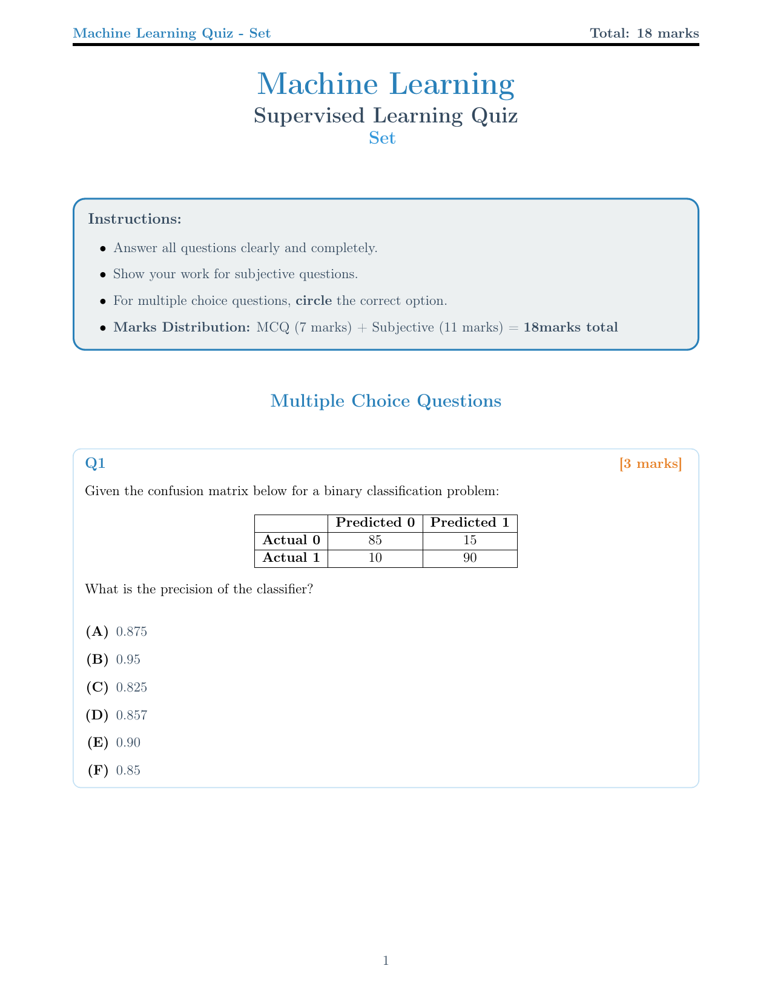
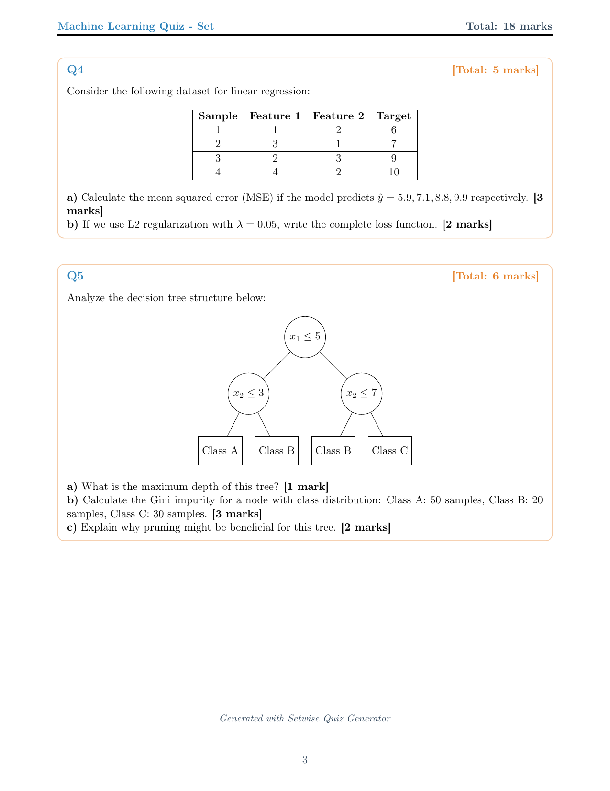

# Setwise: Professional LaTeX Quiz Generator

[](https://github.com/nipunbatra/setwise/actions/workflows/ci.yml)
[](https://codecov.io/gh/nipunbatra/setwise)
[](https://www.python.org/downloads/)
[](https://opensource.org/licenses/MIT)
[](https://github.com/nipunbatra/setwise/issues?q=is%3Aissue+is%3Aopen+label%3Asecurity)

> A professional Python-based quiz generation system that creates beautiful, randomized PDF quizzes with comprehensive machine learning content.

## Template Showcase - 3 Professional Templates

### Default Template (Professional)
Professional single-column layout with color-coded sections and spacious design

**Quiz Set 1 (All Pages)**
<div align="center">

| Page 1 | Page 2 | Page 3 |
|--------|--------|--------|
|  |  |  |

</div>

**Quiz Set 2 (Same Questions, Different Order)**
<div align="center">

| Page 1 | Page 2 | Page 3 |
|--------|--------|--------|
|  |  |  |

📄 **[Download PDF - Default Template](assets/default_sample.pdf)**

**Use case:** Formal presentations, exams, professional documentation (3-4 pages typical)
</div>

### Compact Template (Space-Efficient)
Two-column layout with multi-column MCQ options for maximum space efficiency

**Quiz Set 1 vs Set 2 Comparison**
<div align="center">

| Quiz Set 1 | Quiz Set 2 |
|-------------|-------------|
|  |  |

📄 **[Download PDF - Compact Template](assets/compact_sample.pdf)**

**Use case:** Printing, quick distribution, saving paper (1-2 pages typical)
</div>

### Minimal Template (Clean)
Minimalist black and white design with clean typography and high contrast

**Quiz Set 1 vs Set 2 Comparison**
<div align="center">

| Quiz Set 1 | Quiz Set 2 |
|-------------|-------------|
|  |  |

📄 **[Download PDF - Minimal Template](assets/minimal_sample.pdf)**

**Use case:** Black & white printing, simple assessments, distraction-free (1-2 pages typical)
</div>

**Notice the Smart Randomization:** Same questions appear in both sets, but with shuffled MCQ options and different question order. Perfect for preventing cheating while maintaining fair assessment.

## Key Features

### 📄 Professional Output
- **Beautiful LaTeX Output** - Professional styling with color-coded sections
- **Multiple Templates** - 3 built-in templates: default, compact, minimal  
- **Rich Content** - Tables, TikZ diagrams, matplotlib plots, mathematical equations
- **Template Management** - Plug-and-play template system with easy selection

### 🔀 Smart Generation
- **Smart Randomization** - MCQ options and question order shuffling with same questions across sets
- **Template Support** - Dynamic questions with variable substitution
- **CLI Interface** - Full command-line control with reproducible seeds
- **Robust Validation** - Input validation and graceful error handling

### 🛡️ Security & Quality
- **Secure by Design** - No shell injection vulnerabilities, XSS protection
- **85% Test Coverage** - Comprehensive pytest suite with 84+ test cases
- **Automated Security Scanning** - Bandit, Safety, CodeQL, pip-audit
- **Dependency Management** - Dependabot for automatic security updates
- **CI/CD Pipeline** - Multi-stage testing, security scanning, and deployment

### 📦 Modern Distribution
- **Pip Installable** - Modern Python packaging with pyproject.toml
- **Multiple Install Options** - Basic, development, and security extras
- **Cross-Platform** - Works on Windows, macOS, and Linux
- **Python 3.8+** - Support for modern Python versions
- **Professional CLI** - Intuitive command-line interface with help system

### 🔬 Educational Excellence  
- **Comprehensive ML Content** - 20 MCQ + 15 subjective questions on supervised learning
- **Answer Keys** - Detailed explanations and solutions
- **Reproducible Assessment** - Consistent evaluation across different quiz sets

## Installation

```bash
# Install from GitHub source
pip install git+https://github.com/nipunbatra/setwise.git

# For development with all tools
pip install git+https://github.com/nipunbatra/setwise.git[dev,security]
```

## Quick Start

```bash
# Generate figures (TikZ diagrams and matplotlib plots)
setwise generate-figures

# Generate sample quizzes with default settings
setwise generate --seed 42

# Generate 5 quiz sets with specific question counts
setwise generate --seed 123 --sets 5 --mcq 3 --subjective 2

# Use a different template
setwise generate --template compact --sets 2

# List available templates
setwise list-templates

# Generate without PDF compilation (LaTeX only)
setwise generate --no-pdf --sets 1

# Custom output directory
setwise generate --output-dir my_quizzes --sets 3
```

### Python API Usage

```python
from setwise import QuizGenerator, TemplateManager

# Create quiz generator
generator = QuizGenerator(output_dir="my_output")

# Generate quiz sets programmatically
success = generator.generate_quizzes(
    num_sets=3,
    num_mcq=5,
    num_subjective=2,
    template_name="compact",
    seed=42
)

# List available templates
tm = TemplateManager()
print(tm.list_templates())
```

## Command Line Options

### Generate Command
```bash
setwise generate [OPTIONS]

Options:
  --seed SEED           Random seed for reproducibility (default: random)
  --sets SETS           Number of quiz sets to generate (default: 3)
  --mcq MCQ             Number of MCQ questions per set (default: all available)
  --subjective NUM      Number of subjective questions per set (default: all available)
  --no-pdf              Skip PDF compilation, generate only LaTeX files
  --output-dir DIR      Output directory for generated files (default: ./output)
  --template NAME       Template to use: default, compact, minimal (default: default)
```

### Other Commands
```bash
setwise list-templates    # List all available templates with descriptions
setwise generate-figures  # Generate TikZ diagrams and matplotlib plots
```

### Examples

```bash
# Generate 5 sets with specific question counts and reproducible seed
setwise generate --seed 123 --sets 5 --mcq 3 --subjective 2

# Generate only LaTeX files without PDF compilation
setwise generate --no-pdf --sets 2

# Use custom output directory
setwise generate --output-dir ./my_quizzes --sets 1

# List all available templates with descriptions
setwise list-templates

# Use compact template for space-efficient 2-column layout
setwise generate --seed 42 --sets 2 --template compact

# Use minimal template for clean black & white printing
setwise generate --seed 42 --sets 2 --template minimal
```

## Development & Testing

### Development Installation
```bash
# Clone and install in development mode
git clone https://github.com/nipunbatra/setwise.git
cd setwise
pip install -e .[dev,security]
```

### Testing & Quality Assurance
```bash
# Run comprehensive test suite
python -m pytest -v

# Generate test coverage report
python -m pytest --cov=setwise --cov-report=html

# Run security tests locally
./scripts/security_test.sh

# Run specific test categories
python -m pytest test_main.py::TestMCQShuffling -v
python -m pytest test_main.py::TestQuizGeneration -v
```

### Package Building & Distribution
```bash
# Build package for distribution
python -m build

# Check package integrity
twine check dist/*

# Install locally built package
pip install dist/setwise-*.whl

# Publish to PyPI (maintainers only)
twine upload dist/*
```

### Requirements
- **Python**: 3.8+ (tested on 3.8, 3.9, 3.10, 3.11, 3.12)
- **LaTeX**: pdflatex for PDF compilation
- **System**: poppler-utils for PDF to image conversion (preview generation)

**Test Coverage includes:**
- MCQ option shuffling and answer key tracking
- Subjective question processing with template variables
- Quiz generation reproducibility with seeds
- CLI argument parsing and validation
- LaTeX compilation and error handling
- Data integrity and question consistency checks
- File operations and output validation

## Machine Learning Content

The quiz system includes comprehensive supervised learning topics:

### Multiple Choice Questions (20 Questions, 5-6 Options Each)
- **Bias-Variance Tradeoff** - Understanding model complexity implications
- **Confusion Matrix Analysis** - Precision, recall, accuracy calculations  
- **Regularization Techniques** - L1 (Lasso), L2 (Ridge), Elastic Net comparisons
- **Decision Trees** - Impurity measures, pruning, overfitting
- **Support Vector Machines** - Kernels, margin optimization, hyperparameters
- **Cross-Validation** - k-fold, stratified, leave-one-out strategies
- **Performance Metrics** - ROC curves, AUC, F1-score interpretations
- **Neural Networks** - Activation functions, backpropagation, architectures
- **Ensemble Methods** - Random Forest, bagging vs boosting principles
- **Feature Engineering** - Scaling, normalization, preprocessing techniques
- **Optimization** - Gradient descent, learning rates, convergence
- **Model Evaluation** - Validation curves, hyperparameter selection
- **k-Nearest Neighbors** - Distance metrics, curse of dimensionality
- **Logistic Regression** - Sigmoid function, probability mapping

### Subjective Questions (15 Questions with Detailed Solutions)
- **Decision Tree Analysis** - Depth calculation, Gini impurity, pruning benefits
- **Linear Regression** - MSE calculation, regularization loss functions  
- **Learning Curves** - Bias vs variance diagnosis, overfitting gap analysis
- **Support Vector Machines** - Support vectors, margin concepts, kernel complexity
- **Overfitting Analysis** - Model comparison, regularization parameter selection
- **k-Nearest Neighbors** - Time complexity, preprocessing, parameter selection
- **Neural Networks** - Backpropagation, weight updates, gradient problems
- **Ensemble Methods** - Majority voting, accuracy calculations, method comparison
- **Algorithm Comparison** - Assumptions, strengths, weaknesses analysis
- **Mathematical Derivations** - Logistic regression gradient descent
- **Model Selection** - Validation vs test error, data leakage prevention
- **Real-world Applications** - Customer churn prediction pipeline design
- **Optimization Analysis** - SGD vs Adam vs RMSprop comparison
- **Dimensionality Reduction** - PCA vs t-SNE, curse of dimensionality

## Visual Elements & Rich Content

### Generated Content Types
- **TikZ Diagrams**: Decision trees, neural network architectures, SVM margin illustrations
- **Matplotlib Plots**: ROC curves, learning curves, classification boundaries, regression analysis
- **Professional Tables**: Confusion matrices, dataset samples, algorithm comparison tables
- **Mathematical Equations**: Properly typeset with LaTeX for loss functions, derivatives, formulas
- **Color-Coded Sections**: Blue for MCQs, orange for subjective questions, structured layout

### Template Features
- **Dynamic Variables**: Randomized numerical values in questions
- **Consistent Formatting**: Professional typography with custom color scheme
- **Responsive Layout**: Proper spacing, margins, and section organization
- **Answer Key Generation**: Automatic tracking of correct answers with question mapping

## Technical Architecture

### Core Technology Stack
- **Python 3.8+** - Main application logic and CLI interface
- **Jinja2** - Template rendering engine for LaTeX generation  
- **LaTeX/PDFTeX** - Professional document typesetting and PDF output
- **TikZ** - Programmatic diagram generation for decision trees, neural networks
- **Matplotlib** - Statistical plot generation with PDF export
- **pytest** - Comprehensive testing framework with coverage reporting

### Key Components
- **`main.py`** - Quiz generation engine with CLI interface
- **`data/questions.py`** - Machine learning question database with metadata
- **`templates/`** - LaTeX template system with 4 built-in templates and management
- **`generate_figures.py`** - TikZ and matplotlib figure generation
- **`test_main.py`** - Comprehensive test suite (22+ test cases)

## Repository Structure

```
setwise/
├── .github/
│   └── workflows/          # GitHub Actions CI/CD pipelines
│       ├── ci.yml         # Multi-Python testing, linting, integration
│       └── pages.yml      # GitHub Pages deployment with PDF conversion
├── data/
│   └── questions.py       # Machine learning question database
├── templates/
│   ├── quiz_template.tex.jinja         # Default professional template
│   ├── quiz_template_compact.tex.jinja # Space-efficient 2-column template
│   ├── quiz_template_minimal.tex.jinja # Clean minimal template
│   └── template_config.py              # Template management system
├── figures/               # Generated TikZ diagrams and plots
│   ├── *.tikz            # TikZ diagram files
│   └── *.pdf             # Matplotlib generated plots
├── output/                # Generated quiz files
│   ├── quiz_set_*.tex    # LaTeX source files
│   ├── quiz_set_*.pdf    # Compiled PDF quizzes
│   └── answer_key_*.txt  # Answer keys with explanations
├── docs/                  # GitHub Pages documentation
│   └── assets/           # Images and downloadable PDFs
├── test_main.py          # Comprehensive test suite
├── main.py               # Main quiz generation engine
├── generate_figures.py   # Figure generation script
├── requirements.txt      # Python dependencies
└── README.md            # This documentation
```

## Requirements

- **Python 3.11+**
- **TinyTeX** (lightweight LaTeX distribution)
- **Required packages**: `jinja2`, `matplotlib`, `numpy`, `pytest`

### LaTeX Installation
- **Linux/macOS**: `wget -qO- "https://yihui.org/tinytex/install-bin-unix.sh" | sh`
- **Windows**: Download from https://yihui.org/tinytex/
- **Required LaTeX packages**: Automatically installed via `tlmgr` during first use

## Development & Contributing

### Local Development Setup
```bash
# Clone and setup development environment
git clone https://github.com/nipunbatra/setwise.git
cd setwise
python -m venv venv
source venv/bin/activate  # On Windows: venv\Scripts\activate
pip install -r requirements.txt
```

### Testing Workflow
```bash
# Generate required figures
python generate_figures.py

# Run full test suite
python -m pytest -v --cov=main

# Test specific functionality
python -m pytest test_main.py::TestMCQShuffling -v
python -m pytest test_main.py::TestCLIInterface -v

# Run integration tests
python main.py --seed 42 --sets 1 --no-pdf
```

### Contributing Guidelines
1. Fork the repository
2. Create a feature branch: `git checkout -b feature/amazing-feature`
3. Add comprehensive tests for new functionality
4. Ensure all tests pass: `python -m pytest`
5. Follow code style: `black .` and `flake8 .`
6. Update documentation as needed
7. Submit a pull request with detailed description

## Deployment & CI/CD

### GitHub Actions Workflows
- **Continuous Integration**: Python 3.11 testing
- **Code Quality**: Black formatting, flake8 linting, isort import sorting
- **Integration Testing**: Full quiz generation with LaTeX compilation
- **GitHub Pages**: Automated documentation deployment with PDF previews

### Deployment Features
- **Artifact Storage**: Generated quizzes stored as GitHub Actions artifacts
- **PDF Conversion**: Automatic PNG preview generation for documentation
- **Coverage Reporting**: Codecov integration for test coverage tracking
- **Single Environment**: Testing on Python 3.11 for faster CI

## Performance & Scalability

### Optimization Features  
- **Efficient Randomization**: Consistent question sets with shuffled options only
- **Template Caching**: Jinja2 template compilation optimization
- **Lazy Loading**: Questions loaded only when needed
- **Error Handling**: Graceful degradation for LaTeX compilation failures

### Resource Usage
- **Memory Efficient**: Minimal memory footprint for large question sets
- **Fast Generation**: Typical quiz generation < 2 seconds
- **Concurrent Safe**: Thread-safe for parallel quiz generation
- **Storage Optimized**: Compressed PDF output with vector graphics

## License & Usage

**MIT License** - Free for educational and commercial use.

```
Copyright (c) 2024 Setwise Contributors

Permission is hereby granted, free of charge, to any person obtaining a copy
of this software and associated documentation files (the "Software"), to deal
in the Software without restriction, including without limitation the rights
to use, copy, modify, merge, publish, distribute, sublicense, and/or sell
copies of the Software, and to permit persons to whom the Software is
furnished to do so, subject to the following conditions:

The above copyright notice and this permission notice shall be included in all
copies or substantial portions of the Software.
```

## Support & Community

- **Issues**: [Report bugs and request features](https://github.com/nipunbatra/setwise/issues)
- **Discussions**: [Community discussions and Q&A](https://github.com/nipunbatra/setwise/discussions)
- **Documentation**: [Full documentation on GitHub Pages](https://nipunbatra.github.io/setwise)
- **Contributing**: See [CONTRIBUTING.md](CONTRIBUTING.md) for detailed guidelines

---

<div align="center">

**Made for educators and students worldwide**

*Empowering assessment through technology*

</div>