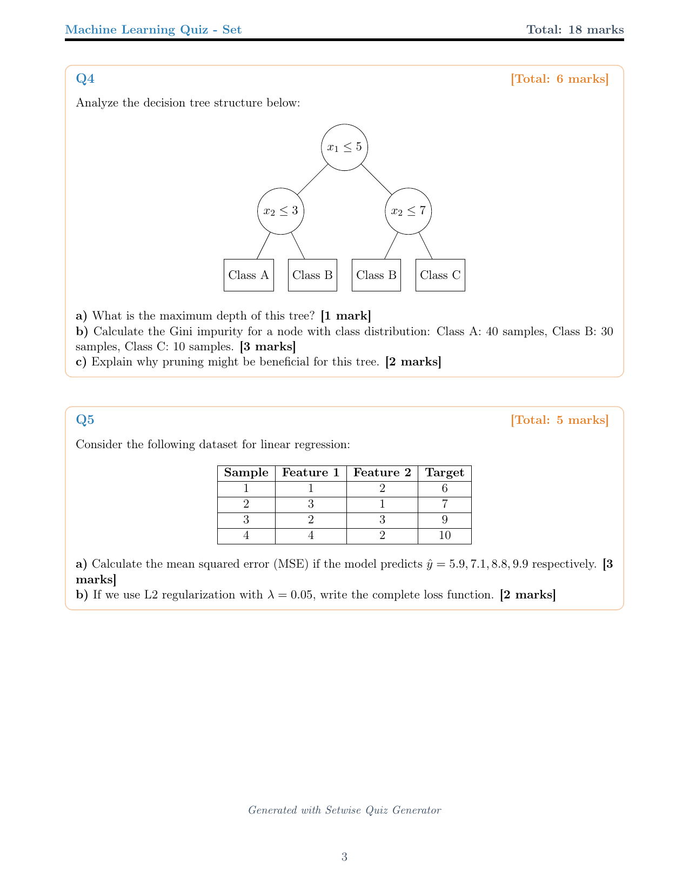
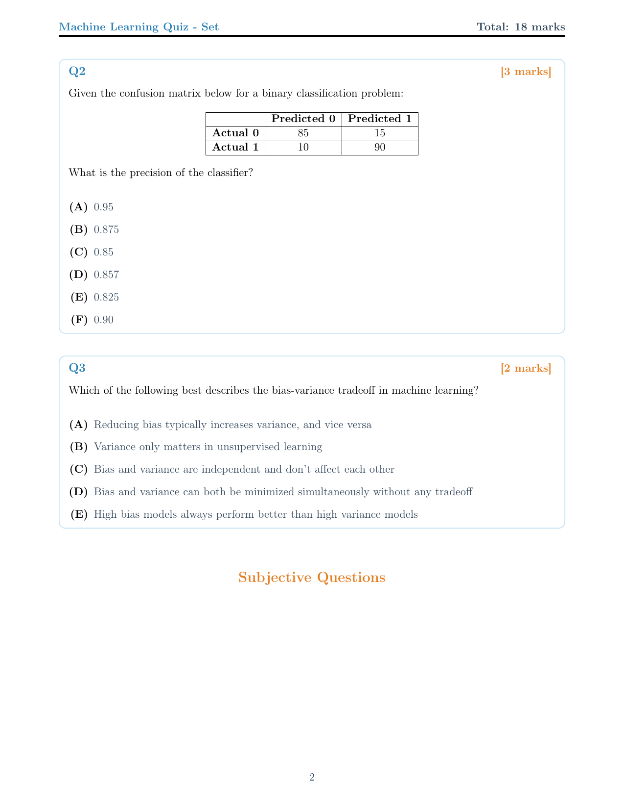
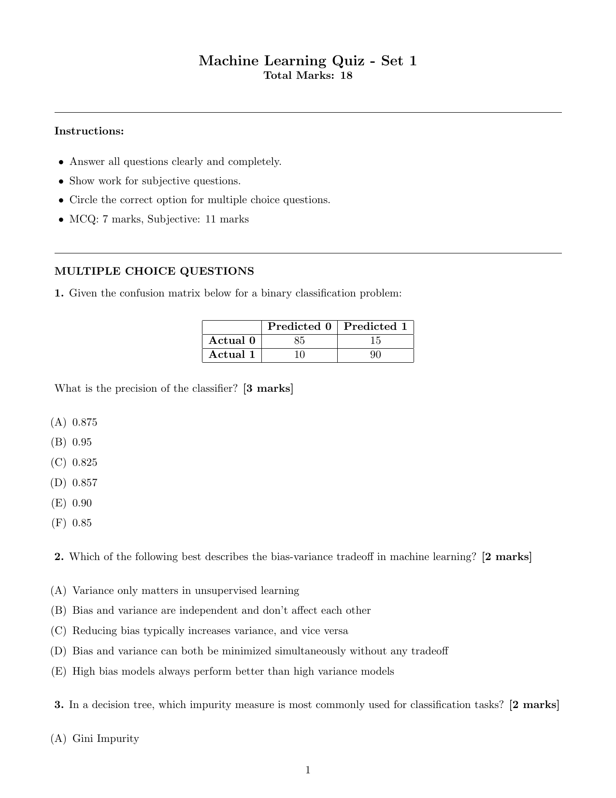
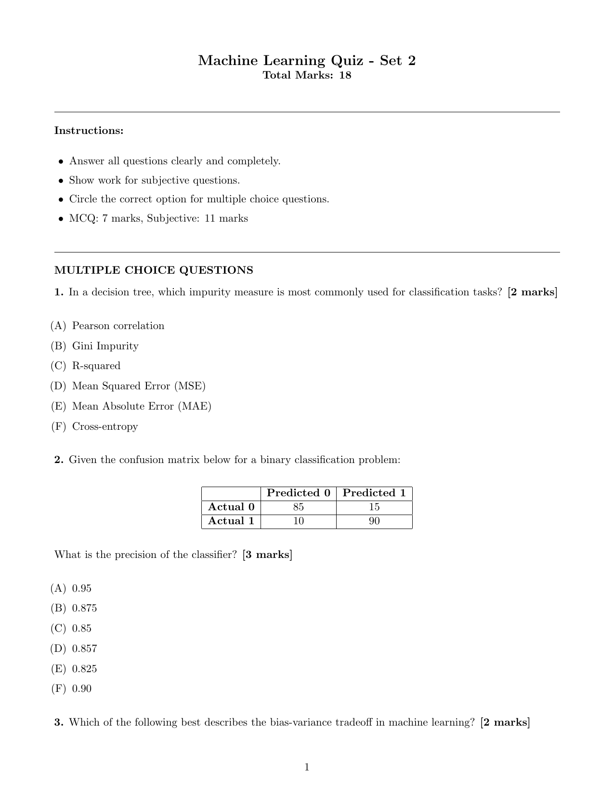

# Templates Guide

Comprehensive guide to Setwise's template system, customization options, and visual showcase.

## Table of Contents

- [Template Overview](#template-overview)
- [Template Showcase](#template-showcase)
- [Choosing Templates](#choosing-templates)
- [Template Features](#template-features)
- [Customization](#customization)
- [Template Development](#template-development)

## Template Overview

Setwise provides three professional LaTeX templates designed for different use cases and printing requirements. Each template maintains high-quality typography while offering distinct layouts and styling approaches.

### Available Templates

| Template | Layout | Use Case | Pages | Best For |
|----------|---------|----------|-------|----------|
| **Default** | Single column | Formal exams | 3-4 | Professional presentations, official exams |
| **Compact** | Two column | Space efficient | 1-2 | Printing, paper saving, quick distribution |
| **Minimal** | Single column | Clean design | 1-2 | Simple assessments, black & white printing |

### Template Selection

```bash
# List all available templates
setwise list-templates

# Generate with specific template
setwise generate --template compact --sets 2
setwise generate --template minimal --sets 1
setwise generate --template default --sets 3
```

## Template Showcase

### Default Template (Professional)

**Design Philosophy**: Professional single-column layout with color-coded sections and spacious design for formal examinations.

**Visual Features**:
- Color-coded section headers (blue for MCQ, orange for subjective)
- Professional typography with generous spacing
- Clear question numbering and mark allocation
- Consistent formatting throughout

**Quiz Set 1 (All Pages)**

| Page 1 | Page 2 | Page 3 |
|--------|--------|--------|
|  |  |  |

**Quiz Set 2 (Same Questions, Different Order)**

| Page 1 | Page 2 | Page 3 |
|--------|--------|--------|
|  |  |  |

**[Download PDF Sample - Default Template](../assets/default_sample.pdf)**

**Specifications**:
- **Page size**: A4 (210×297mm)
- **Margins**: 2.5cm all sides
- **Font**: Computer Modern (LaTeX default)
- **Line spacing**: 1.2
- **Typical length**: 3-4 pages

**Best for**:
- Formal university examinations
- Professional certification tests
- Official assessments requiring polished presentation
- High-stakes evaluations

### Compact Template (Space-Efficient)

**Design Philosophy**: Two-column layout with multi-column MCQ options for maximum space efficiency without sacrificing readability.

**Visual Features**:
- Two-column main layout for optimal space usage
- Multi-column MCQ options (up to 3 columns)
- Condensed but readable typography
- Smart space allocation between sections

**Quiz Set Comparison**

| Quiz Set 1 | Quiz Set 2 |
|-------------|-------------|
|  |  |

**[Download PDF Sample - Compact Template](../assets/compact_sample.pdf)**

**Specifications**:
- **Page size**: A4 (210×297mm)
- **Layout**: Two-column (40mm gap)
- **Font**: Computer Modern, slightly condensed
- **Line spacing**: 1.1
- **Typical length**: 1-2 pages

**Best for**:
- Cost-effective printing
- Quick distribution and review
- Classroom handouts
- Practice quizzes and assignments

### Minimal Template (Clean)

**Design Philosophy**: Minimalist black and white design with clean typography and high contrast for maximum readability.

**Visual Features**:
- Pure black and white design (no colors)
- Clean, sans-serif inspired typography
- High contrast for excellent readability
- Distraction-free layout

**Quiz Set Comparison**

| Quiz Set 1 | Quiz Set 2 |
|-------------|-------------|
|  |  |

**[Download PDF Sample - Minimal Template](../assets/minimal_sample.pdf)**

**Specifications**:
- **Page size**: A4 (210×297mm)
- **Design**: Monochrome only
- **Font**: Computer Modern with minimal styling
- **Line spacing**: 1.15
- **Typical length**: 1-2 pages

**Best for**:
- Black and white printing
- Simple classroom assessments
- Accessibility-focused environments
- Quick reference and study materials

## Choosing Templates

### Decision Matrix

#### By Use Case

**Formal Examinations**
```bash
setwise generate --template default --sets 5
```
- University finals, certification exams
- Professional assessments
- High-stakes evaluations

**Regular Assessments**
```bash
setwise generate --template compact --sets 3
```
- Weekly quizzes, homework assignments
- Practice tests, review materials
- Classroom activities

**Simple Evaluations**
```bash
setwise generate --template minimal --sets 2
```
- Quick checks, pop quizzes
- Study guides, reference materials
- Accessible assessments

#### By Printing Requirements

**Color Printing Available**
- **Default template** for professional appearance
- **Compact template** for efficient color usage

**Black & White Printing Only**
- **Minimal template** for optimal contrast
- **Compact template** for space efficiency

**Paper Conservation**
- **Compact template** for maximum questions per page
- **Minimal template** for essential information only

#### By Audience

**Students**
- **Default**: Formal exam environment
- **Compact**: Regular practice and homework
- **Minimal**: Quick reference and study aids

**Educators**
- **Default**: Professional presentation to colleagues
- **Compact**: Efficient grading and distribution
- **Minimal**: Simple creation and modification

**Administrators**
- **Default**: Official documentation and records
- **Compact**: Cost-effective large-scale printing
- **Minimal**: Accessibility compliance

### Template Comparison Commands

```bash
# Generate same quiz in all templates for comparison
setwise generate --template default --sets 1 --output-dir default_output
setwise generate --template compact --sets 1 --output-dir compact_output  
setwise generate --template minimal --sets 1 --output-dir minimal_output

# Compare file sizes
ls -lh */quiz_set_1.pdf

# Compare page counts
pdfinfo */quiz_set_1.pdf | grep Pages
```

## Template Features

### Smart Randomization

**Consistent Across Templates**: All templates implement the same intelligent randomization:

- **Question Order**: Randomized across quiz sets
- **MCQ Options**: Shuffled while maintaining correct answers
- **Answer Keys**: Automatically updated to match shuffled options
- **Reproducible**: Same seed produces identical content across templates

**Example**: Notice in the showcase images how Set 1 and Set 2 contain the same questions but in different orders with shuffled MCQ options.

### Adaptive Content Handling

#### Mathematical Content
```latex
# All templates handle complex LaTeX consistently
$$\int_0^1 \frac{1}{1+x^2} dx = \frac{\pi}{4}$$

# Matrix expressions
$$\begin{pmatrix} a & b \\ c & d \end{pmatrix}$$

# Chemical equations
$$\ce{CH4 + 2O2 -> CO2 + 2H2O}$$
```

#### Figures and Diagrams
- **TikZ diagrams**: Decision trees, neural networks
- **Matplotlib plots**: Statistical graphs, learning curves
- **External figures**: PDF imports, custom graphics

#### Table Handling
```latex
# Confusion matrices, data tables
\begin{tabular}{|c|c|c|}
\hline
 & Predicted + & Predicted - \\
\hline
Actual + & TP & FN \\
\hline
Actual - & FP & TN \\
\hline
\end{tabular}
```

### Responsive Design Elements

#### Question Length Adaptation
- **Short questions**: Efficient spacing in all templates
- **Long questions**: Automatic page breaks and spacing
- **Complex content**: Smart layout adjustments

#### Option Count Flexibility
- **2-3 options**: Optimal layout in all templates
- **4-5 options**: Compact uses multi-column, others adjust spacing
- **6+ options**: Automatic fallback to single-column list

## Customization

### Template Selection Strategy

#### Project-Based Selection
```bash
# Different templates for different courses
setwise generate --template default --questions-file physics_final.yaml --output-dir physics_exam
setwise generate --template compact --questions-file chemistry_quiz.yaml --output-dir chem_quiz
setwise generate --template minimal --questions-file math_practice.yaml --output-dir math_review
```

#### Audience-Based Selection
```bash
# Formal presentation
setwise generate --template default --sets 5 --output-dir board_presentation

# Student distribution
setwise generate --template compact --sets 10 --output-dir student_copies

# Quick reference
setwise generate --template minimal --sets 1 --output-dir reference_sheet
```

### Advanced Template Usage

#### Batch Generation with Different Templates
```bash
# Generate multiple formats for different purposes
for template in default compact minimal; do
    setwise generate \
        --template $template \
        --questions-file master_questions.yaml \
        --sets 3 \
        --output-dir "${template}_version"
done
```

#### Template-Specific Optimization
```bash
# Optimize question count per template
setwise generate --template compact --mcq 15 --subjective 3  # Fits well in compact
setwise generate --template default --mcq 10 --subjective 5  # Professional balance
setwise generate --template minimal --mcq 8 --subjective 2   # Clean and simple
```

### Output Customization

#### Directory Organization
```bash
# Organize by template and date
DATE=$(date +%Y%m%d)
setwise generate --template default --output-dir "exams/default_${DATE}"
setwise generate --template compact --output-dir "quizzes/compact_${DATE}"
```

#### File Naming Patterns
```bash
# Template-specific naming
setwise generate --template default --output-dir formal_exam_v1
setwise generate --template compact --output-dir practice_quiz_v2
setwise generate --template minimal --output-dir study_guide_v1
```

## Template Development

### Template Architecture

Each template is built using the Jinja2 templating system with LaTeX:

```
templates/
├── quiz_template.tex.jinja          # Default template
├── quiz_template_compact.tex.jinja  # Compact template  
├── quiz_template_minimal.tex.jinja  # Minimal template
└── template_config.py               # Template management
```

### Template Structure

#### Base Template Elements
```latex
% Document class and packages
\documentclass[11pt,a4paper]{article}
\usepackage{geometry,xcolor,tikz,amsmath}

% Template-specific styling

\usepackage{multicol}
\setlength{\columnsep}{5mm}


% Content generation

\item {{ question.question }}

\item[{{ loop.index0|choice_letter }})] {{ option }}


```

#### Template Variables
Available variables in all templates:
- `mcq_questions`: List of MCQ questions
- `subjective_questions`: List of subjective questions
- `quiz_set_number`: Current set number
- `total_marks`: Calculated total marks
- `generation_date`: When quiz was generated
- `template_name`: Active template name

### Creating Custom Templates

#### Basic Custom Template
```latex
% custom_template.tex.jinja
\documentclass{article}
\usepackage{geometry}
\geometry{margin=2cm}

\begin{document}

\title{My Custom Quiz Template}
\date{\today}
\maketitle

% Custom MCQ section
\section{Multiple Choice Questions}

\textbf{Question {{ loop.index }}:} {{ question.question }}


{{ loop.index }}. {{ option }}


\vspace{0.5cm}


\end{document}
```

#### Template Registration
```python
# In template_config.py
TEMPLATES = {
    "default": "quiz_template.tex.jinja",
    "compact": "quiz_template_compact.tex.jinja", 
    "minimal": "quiz_template_minimal.tex.jinja",
    "custom": "custom_template.tex.jinja"  # Add custom template
}
```

#### Using Custom Templates
```bash
# After adding to template system
setwise generate --template custom --sets 2
```

### Template Best Practices

#### Design Principles
1. **Readability**: Ensure clear typography and spacing
2. **Consistency**: Maintain uniform styling throughout
3. **Accessibility**: Consider color contrast and font sizes
4. **Printability**: Test on actual printers and paper
5. **Scalability**: Handle varying question counts gracefully

#### LaTeX Best Practices
```latex
% Use semantic markup
\newcommand{\questiontext}[1]{\textbf{#1}}
\newcommand{\optiontext}[1]{\item #1}

% Define consistent spacing
\setlength{\itemsep}{0.5em}
\setlength{\parskip}{0.5em}

% Handle page breaks intelligently
\needspace{3\baselineskip}
```

#### Testing Templates
```bash
# Test with different question counts
setwise generate --template custom --mcq 5 --subjective 2 --sets 1
setwise generate --template custom --mcq 15 --subjective 5 --sets 1
setwise generate --template custom --mcq 25 --subjective 10 --sets 1

# Test with complex content
setwise generate --template custom --questions-file complex_math.yaml --sets 1
```

---

**Template Resources**:
- View all template samples in the [assets/images/](../assets/images/) directory
- Download PDF examples from [assets/](../assets/) directory
- Check the [User Guide](USER_GUIDE.md) for generation instructions
- See [LaTeX Guide](LATEX.md) for mathematical typesetting

**Need Help?** Join our [community discussions](https://github.com/nipunbatra/setwise/discussions) for template customization help.