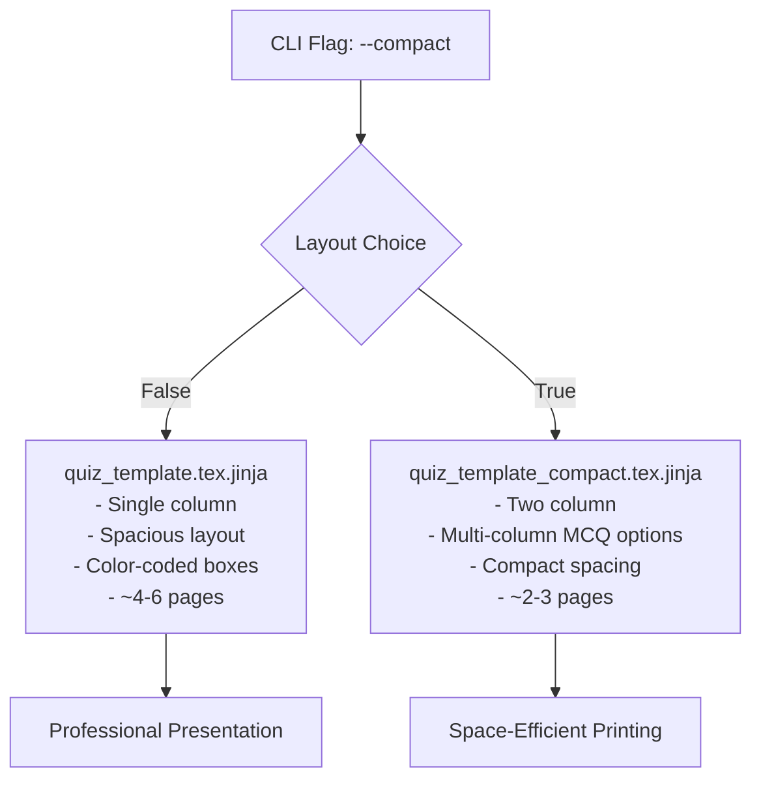

# Setwise System Architecture

## Data Flow Diagram

```mermaid
graph TD
    A[CLI Arguments] --> B[main.py]
    B --> C[validate_inputs()]
    C --> D[Parse Arguments]
    D --> E{Layout Type?}
    E -->|Normal| F[quiz_template.tex.jinja]
    E -->|Compact| G[quiz_template_compact.tex.jinja]
    
    H[data/questions.py] --> I[MCQ Questions<br/>20 questions, 5-6 options]
    H --> J[Subjective Questions<br/>15 questions with templates]
    
    I --> K[shuffle_mcq_options()]
    J --> L[process_subjective_questions()]
    
    K --> M[generate_quiz_set()]
    L --> M
    F --> M
    G --> M
    
    M --> N[Jinja2 Template Engine]
    N --> O[LaTeX Content]
    O --> P[quiz_set_N.tex]
    O --> Q[answer_key_N.txt]
    
    P --> R{PDF Compilation?}
    R -->|Yes| S[pdflatex]
    R -->|No| T[LaTeX Only]
    S --> U[quiz_set_N.pdf]
    
    V[figures/] --> W[TikZ Diagrams<br/>decision_tree.tikz<br/>neural_network.tikz<br/>svm_margin.tikz]
    V --> X[Matplotlib Plots<br/>roc_curve.pdf<br/>learning_curves.pdf<br/>classification_boundary.pdf]
    
    W --> N
    X --> N
    
    Y[GitHub Actions] --> Z[generate_figures.py]
    Z --> V
    Y --> AA[Deploy to GitHub Pages]
    AA --> BB[Quarto Site]
    BB --> CC[https://nipunbatra.github.io/setwise/]
```

## Component Breakdown

### 1. Input Layer
- **CLI Arguments**: User-specified parameters (seed, sets, questions, layout)
- **Question Database**: Structured MCQ and subjective questions with metadata
- **Templates**: Jinja2 LaTeX templates for normal and compact layouts

### 2. Processing Layer
- **Validation**: Input validation and system requirements check
- **Randomization**: Question shuffling and option randomization
- **Template Processing**: Variable substitution in templated questions
- **Content Generation**: LaTeX document creation via Jinja2

### 3. Output Layer
- **LaTeX Files**: Human-readable quiz source code
- **PDF Files**: Compiled professional quiz documents
- **Answer Keys**: Text files with correct answers and explanations

### 4. Deployment Layer
- **GitHub Actions**: Automated CI/CD pipeline
- **Figure Generation**: Automated TikZ and matplotlib content creation
- **GitHub Pages**: Quarto-based documentation website

## Key Features

### Randomization Strategy


### Template System


### Layout Options
