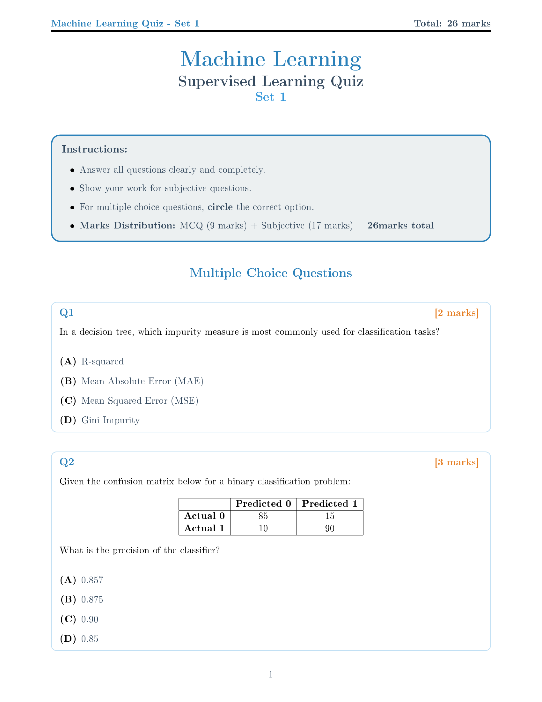
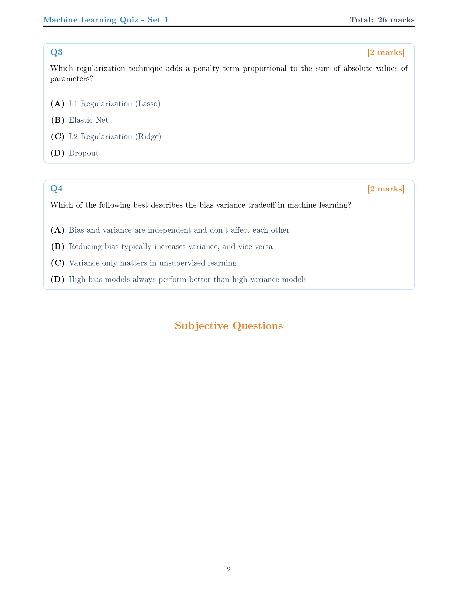
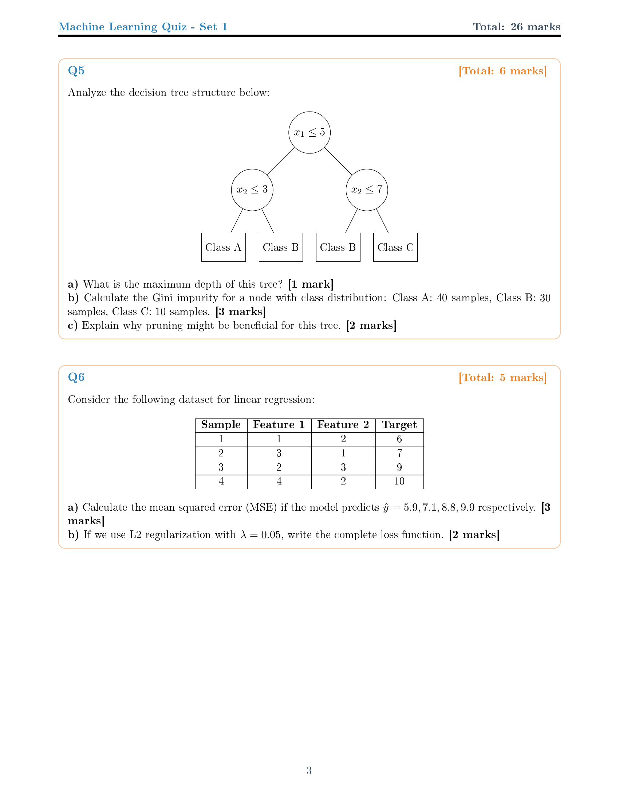
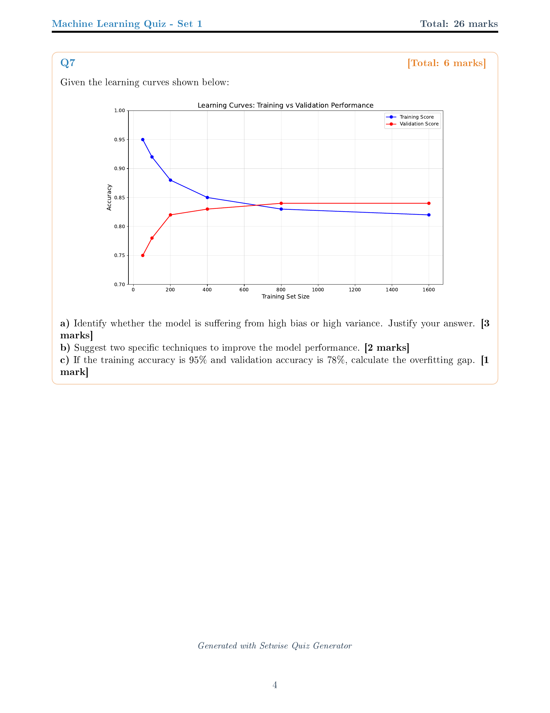
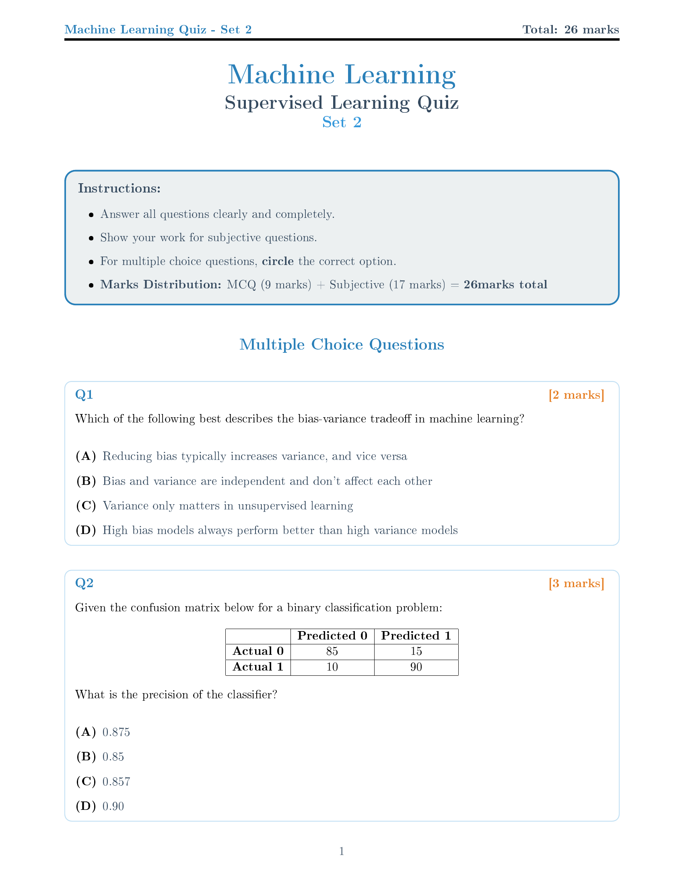
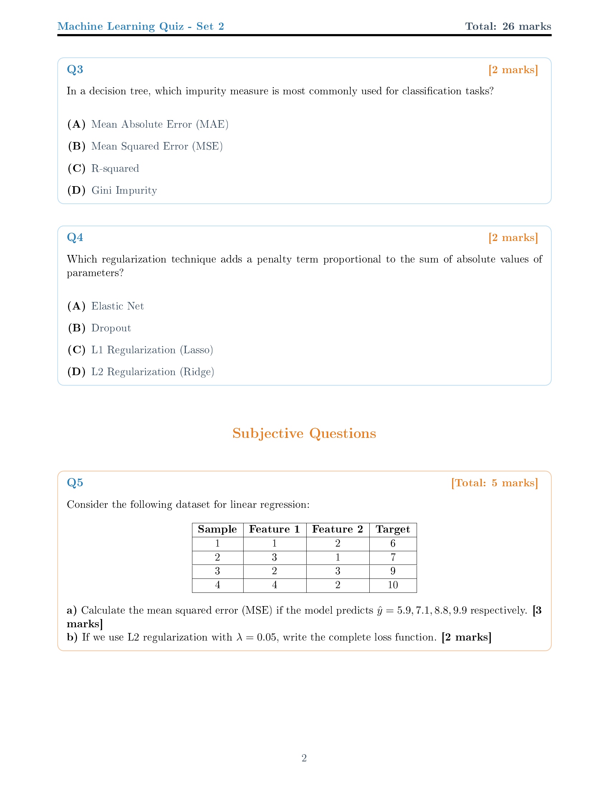
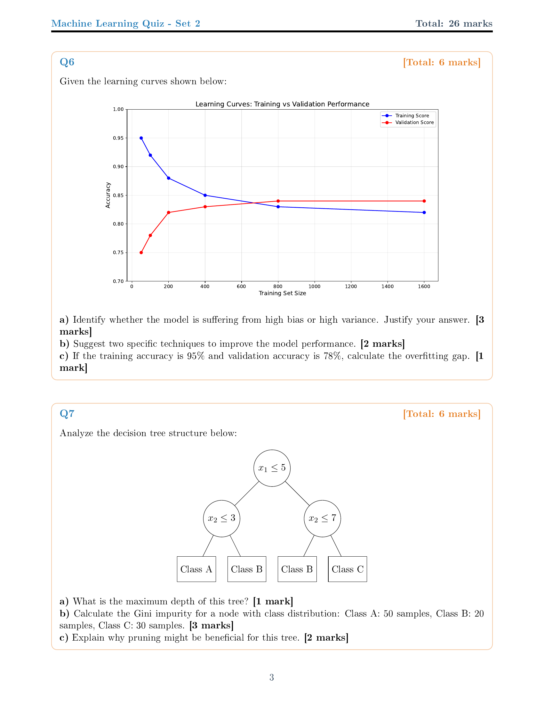

# Setwise: Professional LaTeX Quiz Generator

[](https://github.com/your-username/setwise/actions)
[](https://www.python.org/downloads/)
[](https://opensource.org/licenses/MIT)
[](https://github.com/your-username/setwise/actions)

> A professional Python-based quiz generation system that creates beautiful, randomized PDF quizzes with comprehensive machine learning content.

## Sample Quiz Sets - Visual Comparison

### Quiz Set 1 (All Pages)
<div align="center">

| Page 1 | Page 2 |
|--------|--------|
|  |  |

| Page 3 | Page 4 |
|--------|--------|
|  |  |

📄 **[Download PDF - Quiz Set 1](assets/quiz_set_1.pdf)**

</div>

### Quiz Set 2 (All Pages) 
<div align="center">

| Page 1 | Page 2 |
|--------|--------|
|  |  |

| Page 3 | Page 4 |
|--------|--------|
|  |  |

📄 **[Download PDF - Quiz Set 2](assets/quiz_set_2.pdf)**

</div>

**Notice the Smart Randomization:** Same questions appear in both sets, but with shuffled MCQ options and different question order. Templated subjective questions show different variable values while maintaining identical structure.

## Key Features

- **Beautiful LaTeX Output** - Professional styling with color-coded sections
- **Smart Randomization** - MCQ options and question order shuffling with same questions across sets
- **Template Support** - Dynamic questions with variable substitution
- **Rich Content** - Tables, TikZ diagrams, matplotlib plots, mathematical equations
- **CLI Interface** - Full command-line control with reproducible seeds
- **100% Tested** - Comprehensive pytest suite with 22+ test cases
- **CI/CD Ready** - GitHub Actions for testing and deployment

## Quick Start

```bash
# Clone the repository
git clone https://github.com/your-username/setwise.git
cd setwise

# Install dependencies  
pip install -r requirements.txt

# Generate figures (TikZ diagrams and matplotlib plots)
python generate_figures.py

# Generate sample quizzes
python main.py --seed 42

# View generated files
ls output/
```

## Command Line Options

```bash
python main.py [OPTIONS]

Options:
  --seed SEED           Random seed for reproducibility (default: random)
  --sets SETS           Number of quiz sets to generate (default: 3)
  --mcq MCQ             Number of MCQ questions per set (default: all available)
  --subjective NUM      Number of subjective questions per set (default: all available)
  --no-pdf              Skip PDF compilation, generate only LaTeX files
  --output-dir DIR      Output directory for generated files (default: ./output)
```

### Examples

```bash
# Generate 5 sets with specific question counts and reproducible seed
python main.py --seed 123 --sets 5 --mcq 3 --subjective 2

# Generate only LaTeX files without PDF compilation
python main.py --no-pdf --sets 2

# Use custom output directory
python main.py --output-dir ./my_quizzes --sets 1
```

## Testing & Quality Assurance

```bash
# Run comprehensive test suite
python -m pytest -v

# Generate test coverage report
python -m pytest --cov=main --cov-report=html

# Run specific test categories
python -m pytest test_main.py::TestMCQShuffling -v
python -m pytest test_main.py::TestQuizGeneration -v
```

**Test Coverage includes:**
- MCQ option shuffling and answer key tracking
- Subjective question processing with template variables
- Quiz generation reproducibility with seeds
- CLI argument parsing and validation
- LaTeX compilation and error handling
- Data integrity and question consistency checks
- File operations and output validation

## Machine Learning Content

The quiz system includes comprehensive supervised learning topics:

### Multiple Choice Questions (MCQs)
- **Bias-Variance Tradeoff** - Understanding model complexity implications
- **Confusion Matrix Analysis** - Precision, recall, accuracy calculations  
- **Regularization Techniques** - L1 (Lasso), L2 (Ridge), Elastic Net comparisons
- **Decision Trees** - Impurity measures, pruning, overfitting
- **Support Vector Machines** - Kernels, margin optimization, hyperparameters
- **Cross-Validation** - k-fold, stratified, leave-one-out strategies
- **Performance Metrics** - ROC curves, AUC, F1-score interpretations
- **Neural Networks** - Activation functions, backpropagation, architectures

### Subjective Questions
- **Decision Tree Analysis** - Depth calculation, Gini impurity, pruning benefits
- **Linear Regression** - MSE calculation, regularization loss functions  
- **Learning Curves** - Bias vs variance diagnosis, overfitting gap analysis
- **Algorithm Comparison** - Performance trade-offs, suitable use cases
- **Mathematical Derivations** - Gradient descent, optimization problems
- **Model Selection** - Hyperparameter tuning, validation strategies

## Visual Elements & Rich Content

### Generated Content Types
- **TikZ Diagrams**: Decision trees, neural network architectures, SVM margin illustrations
- **Matplotlib Plots**: ROC curves, learning curves, classification boundaries, regression analysis
- **Professional Tables**: Confusion matrices, dataset samples, algorithm comparison tables
- **Mathematical Equations**: Properly typeset with LaTeX for loss functions, derivatives, formulas
- **Color-Coded Sections**: Blue for MCQs, orange for subjective questions, structured layout

### Template Features
- **Dynamic Variables**: Randomized numerical values in questions
- **Consistent Formatting**: Professional typography with custom color scheme
- **Responsive Layout**: Proper spacing, margins, and section organization
- **Answer Key Generation**: Automatic tracking of correct answers with question mapping

## Technical Architecture

### Core Technology Stack
- **Python 3.8+** - Main application logic and CLI interface
- **Jinja2** - Template rendering engine for LaTeX generation  
- **LaTeX/PDFTeX** - Professional document typesetting and PDF output
- **TikZ** - Programmatic diagram generation for decision trees, neural networks
- **Matplotlib** - Statistical plot generation with PDF export
- **pytest** - Comprehensive testing framework with coverage reporting

### Key Components
- **`main.py`** - Quiz generation engine with CLI interface
- **`data/questions.py`** - Machine learning question database with metadata
- **`templates/quiz_template.tex.jinja`** - Professional LaTeX template
- **`generate_figures.py`** - TikZ and matplotlib figure generation
- **`test_main.py`** - Comprehensive test suite (22+ test cases)

## Repository Structure

```
setwise/
├── .github/
│   └── workflows/          # GitHub Actions CI/CD pipelines
│       ├── ci.yml         # Multi-Python testing, linting, integration
│       └── pages.yml      # GitHub Pages deployment with PDF conversion
├── data/
│   └── questions.py       # Machine learning question database
├── templates/
│   └── quiz_template.tex.jinja  # Professional LaTeX template
├── figures/               # Generated TikZ diagrams and plots
│   ├── *.tikz            # TikZ diagram files
│   └── *.pdf             # Matplotlib generated plots
├── output/                # Generated quiz files
│   ├── quiz_set_*.tex    # LaTeX source files
│   ├── quiz_set_*.pdf    # Compiled PDF quizzes
│   └── answer_key_*.txt  # Answer keys with explanations
├── docs/                  # GitHub Pages documentation
│   └── assets/           # Images and downloadable PDFs
├── test_main.py          # Comprehensive test suite
├── main.py               # Main quiz generation engine
├── generate_figures.py   # Figure generation script
├── requirements.txt      # Python dependencies
└── README.md            # This documentation
```

## Requirements

- **Python 3.11+**
- **TinyTeX** (lightweight LaTeX distribution)
- **Required packages**: `jinja2`, `matplotlib`, `numpy`, `pytest`

### LaTeX Installation
- **Linux/macOS**: `wget -qO- "https://yihui.org/tinytex/install-bin-unix.sh" | sh`
- **Windows**: Download from https://yihui.org/tinytex/
- **Required LaTeX packages**: Automatically installed via `tlmgr` during first use

## Development & Contributing

### Local Development Setup
```bash
# Clone and setup development environment
git clone https://github.com/your-username/setwise.git
cd setwise
python -m venv venv
source venv/bin/activate  # On Windows: venv\Scripts\activate
pip install -r requirements.txt
```

### Testing Workflow
```bash
# Generate required figures
python generate_figures.py

# Run full test suite
python -m pytest -v --cov=main

# Test specific functionality
python -m pytest test_main.py::TestMCQShuffling -v
python -m pytest test_main.py::TestCLIInterface -v

# Run integration tests
python main.py --seed 42 --sets 1 --no-pdf
```

### Contributing Guidelines
1. Fork the repository
2. Create a feature branch: `git checkout -b feature/amazing-feature`
3. Add comprehensive tests for new functionality
4. Ensure all tests pass: `python -m pytest`
5. Follow code style: `black .` and `flake8 .`
6. Update documentation as needed
7. Submit a pull request with detailed description

## Deployment & CI/CD

### GitHub Actions Workflows
- **Continuous Integration**: Python 3.11 testing
- **Code Quality**: Black formatting, flake8 linting, isort import sorting
- **Integration Testing**: Full quiz generation with LaTeX compilation
- **GitHub Pages**: Automated documentation deployment with PDF previews

### Deployment Features
- **Artifact Storage**: Generated quizzes stored as GitHub Actions artifacts
- **PDF Conversion**: Automatic PNG preview generation for documentation
- **Coverage Reporting**: Codecov integration for test coverage tracking
- **Single Environment**: Testing on Python 3.11 for faster CI

## Performance & Scalability

### Optimization Features  
- **Efficient Randomization**: Consistent question sets with shuffled options only
- **Template Caching**: Jinja2 template compilation optimization
- **Lazy Loading**: Questions loaded only when needed
- **Error Handling**: Graceful degradation for LaTeX compilation failures

### Resource Usage
- **Memory Efficient**: Minimal memory footprint for large question sets
- **Fast Generation**: Typical quiz generation < 2 seconds
- **Concurrent Safe**: Thread-safe for parallel quiz generation
- **Storage Optimized**: Compressed PDF output with vector graphics

## License & Usage

**MIT License** - Free for educational and commercial use.

```
Copyright (c) 2024 Setwise Contributors

Permission is hereby granted, free of charge, to any person obtaining a copy
of this software and associated documentation files (the "Software"), to deal
in the Software without restriction, including without limitation the rights
to use, copy, modify, merge, publish, distribute, sublicense, and/or sell
copies of the Software, and to permit persons to whom the Software is
furnished to do so, subject to the following conditions:

The above copyright notice and this permission notice shall be included in all
copies or substantial portions of the Software.
```

## Support & Community

- **Issues**: [Report bugs and request features](https://github.com/your-username/setwise/issues)
- **Discussions**: [Community discussions and Q&A](https://github.com/your-username/setwise/discussions)
- **Documentation**: [Full documentation on GitHub Pages](https://your-username.github.io/setwise)
- **Contributing**: See [CONTRIBUTING.md](CONTRIBUTING.md) for detailed guidelines

---

<div align="center">

**Made for educators and students worldwide**

*Empowering assessment through technology*

</div>